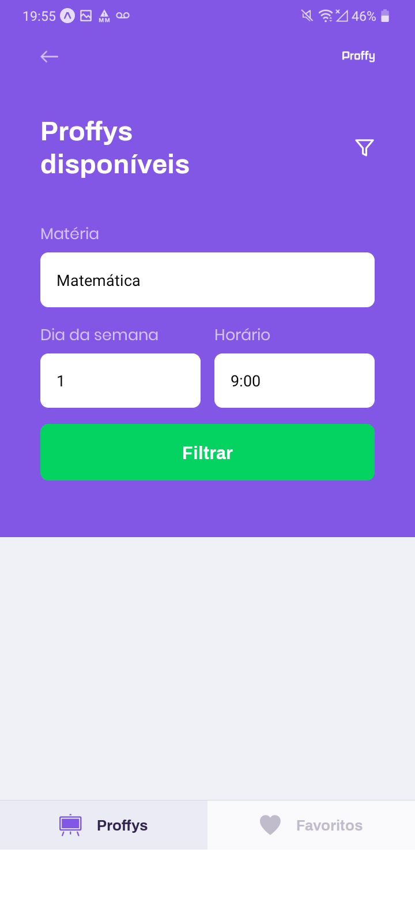

</img>

<h1 align="center">Next Level Week #2</h1>
<p align="center">Projeto <strong>Proffy</strong> da <strong>Rocketseat</strong></p>


# Sobre o projeto

Projeto desenvolvido tendo a mente a situação atual, com a necessidade de se ter aulas onlines, para evitar o contágio pelo COVID-19.

O instrutor do projeto, como sempre, é o <a href="https://github.com/diego3g">Diego</a>.

Nesse projeto foi usada a lib <a href="http://knexjs.org/">Knex.js</a> , que é um query builder. Além disso, usamos o <a href="https://www.npmjs.com/package/sqlite3">SQLite3</a> como banco de dados.

<a href="https://insomnia.rest/">Insomnia</a> foi usado para testar as rotas do backend.
Exportei as configurações usadas no projeto. Sinta-se livre para testa-las.

React e React Native são os frameworks do front-end. Typescript está sendo usado juntamente para garantir um código mais legível e escalável.

<a href="https://expo.io/">Expo</a> foi usado para a criação da parte mobile, por motivos práticos.


# Instalação

Baixe os arquivos do projeto, e dentro de cada pasta principal (**backend, web, mobile**), digite :

```
npm install / yarn install
```

Esse comando irá instalar as dependências de cada projeto.


# API Rest

```` npm run dev / yarn dev ```` para iniciar o servidor. Servidor rodando na porta **3333**

Como não estou enviando o arquivo do banco de dados, você terá que gerá-lo em sua própria máquina:

Digite em sua cmd ```` npm run knex:migrate ```` para gerar o arquivo do banco de dados.

-----------------


# Mobile

Na pasta mobile, em **src/services/api.ts** existe essa configuração: 

```` 
const api = axios.create({
    baseURL: 'http://192.168.2.15:3333'
})

````
Após rodar o comando para iniciar o expo ```` npm run start / yarn start ```` , a interface irá abrir, 
e lá vocẽ terá acesso à porta do seu dispositivo móvel. Troque **192.168.2.15** por seu próprio endereço.


# Web

Para rodar o React : ```` npm run start / yarn start ````.

--------------------------------------------------------------


# Design do projeto

**Web**

</img>
</img>
</img>
</img>


**Mobile**

</img>
</img>
</img>
</img>


# Desafios

Nenhum feito ainda.